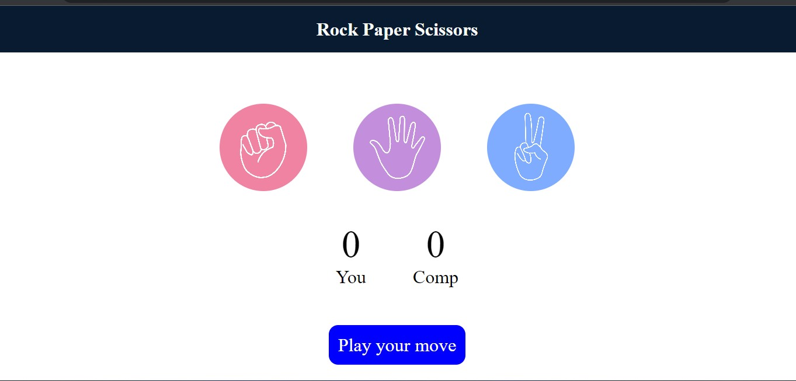
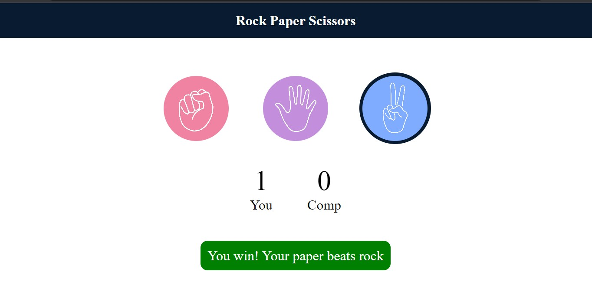
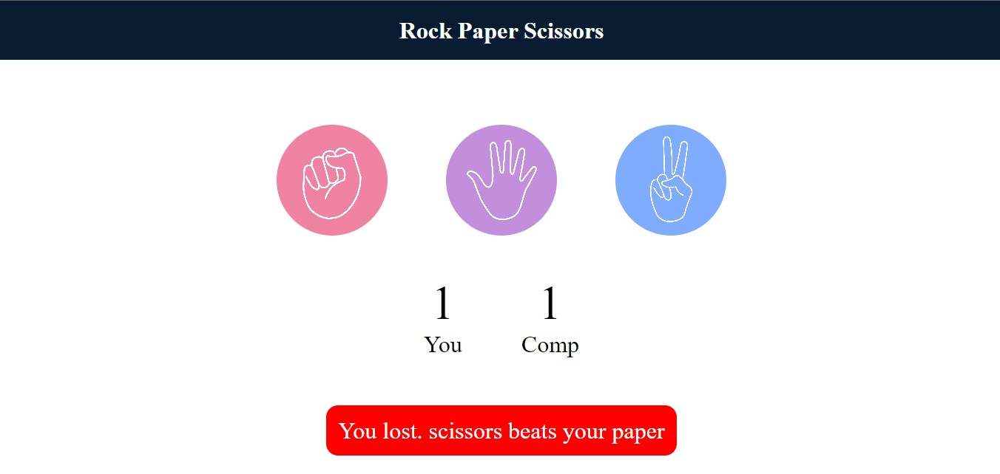
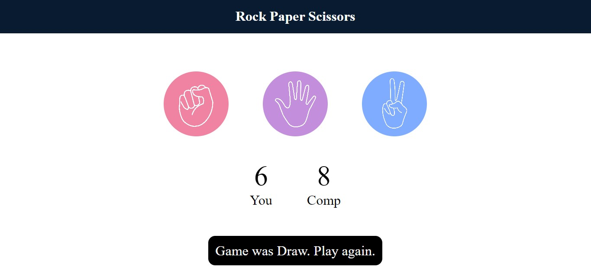

# Rock-Paper-Scissors-Game
-> Developed a Rock Paper Scissors game where user select an option, and the computer randomly generates optimal choice.

-> Implemented logic to determine the winner based on the user's and computer's selections, updating the scoreboard accordingly.

**Technologies used:** HTML, CSS, JavaScript and VS Code.

 

